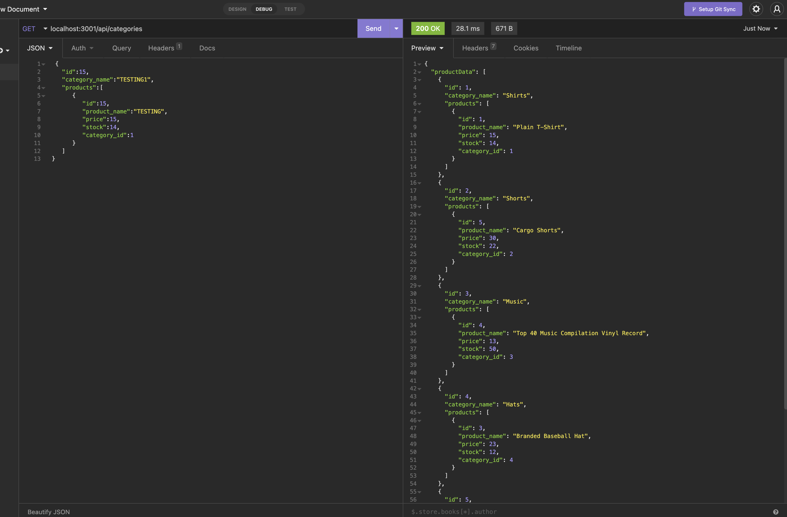

# # Title: ORM-E-COMMERCIAL

## Discription:
* ORM-E-COMMERIAL uses backend api routes for a sql database. You can GET whats in the database. Post to the database. Update. and Delete. 
- What was your motivation? - Wanted to create api routes for a sql database. 
- Why did you build this project? - Practice sequilize and api routes. 
- What problem does it solve? - Can GET whats in the database according to the models. Post, Update and Delete. 
- What did you learn? - learned more about api routes and how to correspond models to the database. 

## Table of Contents (optional)
- [Installation](#installation)
- [Usage](#usage)
- [Credits](#credits)
- [License](#license)

## Installation:
- What are the steps to install your project?
* open insomnia and run the api routes to see what happens!

## Usage:
Add a screenshot, create an `assets/images` folder in your repository and upload your screenshot to it. Then, using the relative filepath, add it to your README using the following syntax: !'[alt text](assets/images/screenshot.png)'
screenshot: 

## Credits:
* Collaborators: n/a
* Assets: n/a
* Tutorials: youtube.com
* Features: n/a
## Links:
* Github link: https://github.com/jonathonvanausdal9915/ORM-E-commercial
* 
* video link: https://drive.google.com/file/d/1CCAaydBEqSYuO6L9P02p98HMF9m9YBIj/view?usp=sharing